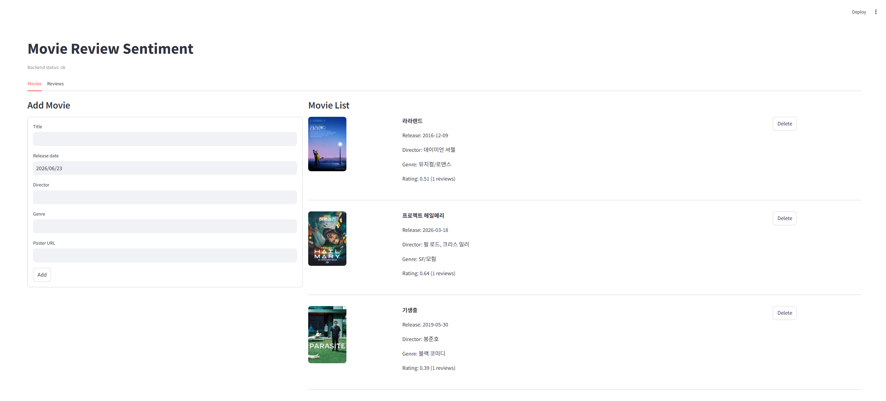
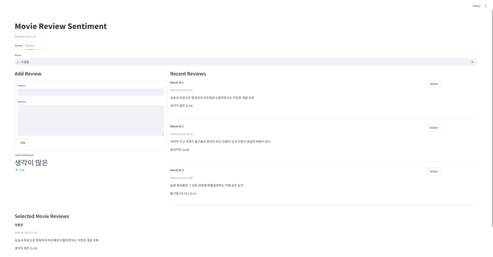

# 영화 리뷰 감성 분석 웹 애플리케이션 보고서

## 1. 서비스 개요

본 프로젝트는 영화 정보와 사용자 리뷰를 등록하고, 리뷰 내용에 대한 감성 분석 결과를 함께 제공하는 웹 애플리케이션이다. 사용자는 Streamlit 기반 프론트엔드에서 영화 목록을 확인하고, 새로운 영화를 등록하거나 영화별 리뷰를 작성할 수 있다. 작성된 리뷰는 FastAPI 백엔드로 전달되며, 백엔드는 리뷰 내용을 분석하여 감성 라벨과 점수를 저장한다.

주요 기능은 다음과 같다.

- 영화 등록, 전체 조회, 특정 영화 조회, 삭제
- 리뷰 등록, 전체 조회, 특정 영화별 리뷰 조회, 삭제
- 리뷰 등록 시 자동 감성 분석
- 영화별 리뷰 감성 점수 평균 조회
- Streamlit 화면을 통한 영화/리뷰 관리

## 2. 서비스 구조

```text
사용자
  ↓
Streamlit Frontend
  ↓ HTTP API 요청
FastAPI Backend
  ↓
SQLite Database
  ↓
Sentiment Analysis Service
```

프론트엔드는 화면 표시와 사용자 입력 처리를 담당한다. 모든 데이터 저장과 조회는 FastAPI 백엔드 API를 통해 수행하며, Streamlit 내부에는 별도의 데이터 저장 기능을 두지 않았다.

백엔드는 영화와 리뷰 데이터를 관리하며, 리뷰 등록 시 감성 분석 서비스를 호출한다. 감성 분석 결과는 리뷰 데이터와 함께 저장되어 이후 최근 리뷰 목록과 영화별 평균 감성 점수 계산에 사용된다.

## 3. 프론트엔드 구조

프론트엔드는 `frontend` 폴더에 구현하였다.

```text
frontend/
  app.py  Streamlit 화면 구성
  api.py  FastAPI 백엔드 요청 함수
```

`app.py`는 영화 목록, 영화 추가 폼, 리뷰 등록 폼, 최근 리뷰 목록, 선택 영화별 리뷰 목록을 화면에 표시한다. `api.py`는 백엔드 API 호출을 담당하며, 로컬 환경에서는 `http://localhost:8000`, 배포 환경에서는 Streamlit Secrets의 `BACKEND_URL` 값을 사용한다.

## 4. 백엔드 구조

백엔드는 `backend` 폴더에 구현하였다.

```text
backend/
  app/
    main.py
    database.py
    models.py
    schemas.py
    routers/
      movies.py
      reviews.py
    services/
      sentiment.py
```

`main.py`는 FastAPI 앱을 생성하고 라우터를 등록한다. `database.py`는 SQLAlchemy DB 연결을 담당한다. `models.py`는 DB 테이블 구조를 정의하고, `schemas.py`는 API 요청/응답 데이터 형식을 정의한다. `movies.py`와 `reviews.py`는 각각 영화와 리뷰 관련 API를 담당한다. `sentiment.py`는 리뷰 감성 분석 로직을 분리하여 관리한다.

## 5. 데이터베이스 구조 ERD

```text
Movie 1 ───── N Review
```

### movies 테이블

| 컬럼 | 설명 |
| --- | --- |
| id | 영화 고유 ID |
| title | 영화 제목 |
| release_date | 개봉일 |
| director | 감독 |
| genre | 장르 |
| poster_url | 포스터 이미지 URL |
| created_at | 등록 시간 |

### reviews 테이블

| 컬럼 | 설명 |
| --- | --- |
| id | 리뷰 고유 ID |
| movie_id | 리뷰가 속한 영화 ID |
| author | 작성자 |
| content | 리뷰 내용 |
| sentiment_label | 감성 분석 라벨 |
| sentiment_score | 감성 분석 점수 |
| created_at | 등록 시간 |

리뷰는 반드시 하나의 영화에 연결되며, 하나의 영화에는 여러 개의 리뷰가 등록될 수 있다.

## 6. API 명세

FastAPI의 `/docs` 화면을 통해 API 명세를 확인할 수 있다.

주요 API는 다음과 같다.

| Method | Endpoint | 설명 |
| --- | --- | --- |
| GET | `/health` | 서버 상태 확인 |
| POST | `/movies` | 영화 등록 |
| GET | `/movies` | 영화 전체 조회 |
| GET | `/movies/{movie_id}` | 특정 영화 조회 |
| DELETE | `/movies/{movie_id}` | 특정 영화 삭제 |
| POST | `/reviews` | 리뷰 등록 및 감성 분석 |
| GET | `/reviews` | 최근 리뷰 조회 |
| GET | `/reviews/movie/{movie_id}` | 특정 영화 리뷰 조회 |
| GET | `/reviews/movie/{movie_id}/rating` | 영화 평균 감성 점수 조회 |
| DELETE | `/reviews/{review_id}` | 특정 리뷰 삭제 |

FastAPI Docs 전체 캡처 이미지를 이 위치에 첨부한다.

## 7. 감성 분석 모델 및 경량화

로컬 개발 환경에서는 Hugging Face의 한국어 감성 분석용 Transformer 계열 모델인 `nlp04/korean_sentiment_analysis_kcelectra`를 적용하였다. 리뷰 등록 시 백엔드가 리뷰 내용을 모델에 전달하고, 반환된 라벨과 점수를 저장한다.

배포 환경에서는 무료 클라우드 서버의 메모리 제한을 고려하여 경량 감성 분석 모드를 함께 구성하였다. `SENTIMENT_MODE` 환경변수에 따라 Transformer 기반 분석과 키워드 기반 경량 분석을 전환할 수 있도록 구현하였다.

경량화 및 안정화 방식은 다음과 같다.

- 모델 로직을 `services/sentiment.py`에 분리하여 교체 가능하게 구성
- 로컬에서는 Transformer 모델 사용 가능
- 배포 환경에서는 `SENTIMENT_MODE=simple`로 키워드 기반 분석 사용
- Transformer 사용 시 `lru_cache`로 모델을 한 번만 로드
- 입력 길이는 `truncation=True`, `max_length=512`로 제한

## 8. 서비스 동작 화면

### 영화 목록 및 영화 등록 화면



### 리뷰 등록 및 최근 리뷰 화면



## 9. 배포

프론트엔드는 Streamlit Cloud, 백엔드는 Render를 이용해 분리 배포를 시도하였다. Streamlit Cloud는 프론트엔드 실행을 담당하고, Render는 FastAPI 백엔드 실행을 담당한다. Streamlit 프론트엔드는 `BACKEND_URL` 설정값을 통해 배포된 FastAPI 백엔드 주소로 API 요청을 보낸다.

배포 구조는 다음과 같다.

```text
사용자 브라우저
  ↓
Streamlit Cloud Frontend
  ↓
Render FastAPI Backend
  ↓
SQLite 또는 외부 DB
```

무료 클라우드 환경에서는 SQLite 파일이 재시작 또는 재배포 시 유지되지 않는 한계가 있었다. 이를 해결하기 위한 개선 방향으로 PostgreSQL 같은 외부 데이터베이스 연결을 고려할 수 있다. 코드에는 `DATABASE_URL` 환경변수를 통한 외부 DB 연결 가능성을 반영하였다.

## 10. 회고

이번 프로젝트를 통해 프론트엔드와 백엔드를 분리한 웹 서비스 구조를 구현하였다. Streamlit은 사용자 화면을 담당하고, FastAPI는 데이터 관리와 감성 분석 API를 담당하도록 역할을 나누었다. 또한 API 문서, DB 모델, 요청/응답 스키마, 감성 분석 서비스 계층을 분리하면서 실제 웹 애플리케이션의 기본 구조를 이해할 수 있었다.

배포 과정에서는 로컬 환경과 클라우드 환경의 차이를 확인하였다. 특히 무료 배포 환경에서 모델 크기와 DB 지속성 문제가 발생할 수 있음을 확인했고, 이를 해결하기 위한 경량 분석 모드와 외부 DB 연결 구조를 설계하였다.
